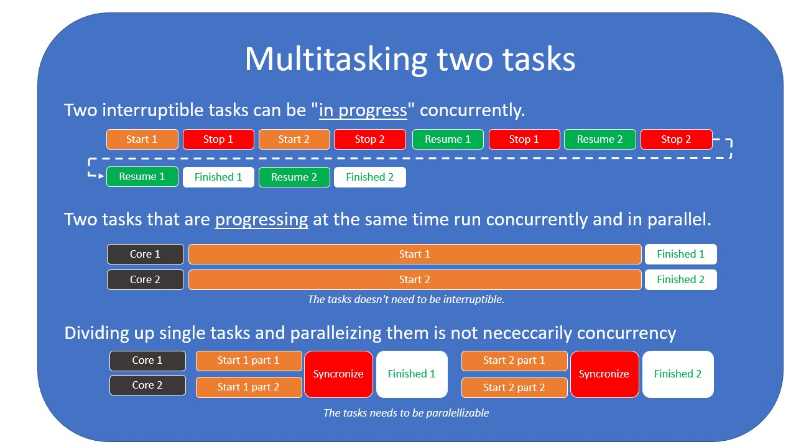

# 并发（Concurrency）和并行（Parallelism）之间的区别是什么？

我们将立即深入探讨这个主题，首先定义并发是什么，因为很容易混淆并发和并行，所以我们必须试图从一开始就澄清区别。

> 并发是关于同时**处理**很多事情的能力。

> 并行是关于同时**执行**很多事情的能力。

我们将同时处理多个任务的概念称为“多任务处理”。多任务处理有几种方式。一种是通过同时进行任务的并发处理，但不是在同一时间。另一种是同时并行处理两个任务。

## 让我们从一些定义开始。

### 资源
用于推进任务的必需物品。我们的资源是有限的。这可能是 CPU 时间或内存。

### 任务
一组需要某种资源来推进的操作。任务必须由多个子操作组成。

### 并行
在**确切**相同的时间独立发生的事情。

### 并发
同时**进行**的任务，但**不一定**同时推进。

这是一个重要的区别。如果两个任务同时运行，但不是并行运行，则它们必须能够停止并恢复其进度。如果任务允许这种并发，我们称该任务为**可中断的**。

## 我使用的思维模型

我坚信我们发现并行和并发编程难以理解的主要原因源于我们在日常生活中对事件建模的方式。我们倾向于宽泛地定义这些术语，因此我们的直觉常常是错误的。
> 在词典中将 **concurrent** 定义为：**同时进行或发生**，这并不真正帮助我们描述它与 **parallel** 有何不同。

对我来说，当我开始理解为什么我们首先要区分并行和并发时，这个概念首次让我恍然大悟！

为什么要区分并行和并发,与资源利用和[效率](https://en.wikipedia.org/wiki/Efficiency)有着密切关系。

> 效率是避免在做某事或产生所期望结果时浪费材料、能量、努力、金钱和时间的（通常可测量的）能力。

### 并行

并行是增加我们用来解决任务的资源。这与**效率**无关。

### 并发

并发与效率和资源利用有着密切关系。并发永远不能使**单个任务运行更快**。它只能帮助我们更好地利用资源，从而**更快地完成一组任务**。

### 让我们对过程经济学进行一些类比

在制造商品的企业中，我们经常谈论精益生产流程。这很容易与程序员为何如此关注并发处理任务所能实现的目标进行比较。

I'll let let this 3 minute video explain it for me:

<iframe width="560" height="315" src="https://www.youtube.com/embed/Oz8BR5Lflzg" frameborder="0" allow="accelerometer; autoplay; encrypted-media; gyroscope; picture-in-picture" allowfullscreen></iframe>

好的，虽然这不是关于这个主题的最新视频，但在3分钟内解释了很多。最重要的是，我们在应用精益技术时尝试实现的收益，最重要的是：**消除等待和非增值任务**。
> 在编程中，我们可以说我们想要避免**阻塞**和**轮询**（在忙等循环中）

在上面的视频中，增加更多资源（更多工人）会有帮助吗？是的，但我们使用双倍的资源来产生与一个人通过优化流程可以做到的相同产出。这并不是最佳的资源利用方式。

> 继续我们开始的类比，我们可以说，我们可以通过启动一个新线程并在那里进行**轮询**或**阻塞**，而不是在主线程中，来解决等待I/O事件发生时UI冻结的问题。然而，新线程要么消耗资源却不做任何事情，要么更糟糕的是，使用一个核心在忙等循环中检查事件是否准备好。无论哪种方式都不是最佳的，特别是如果您运行的是服务器，您希望充分利用资源。

如果您将咖啡机视为某种I/O资源，我们希望启动该过程，然后继续准备下一个任务，或者做其他需要完成的工作，而不是等待。

_但这意味着这里有一些事情是同时发生的？_

是的，咖啡机在工作，而“工作人员”在进行维护和加水。但这就是关键: _我们的参考框架是工作人员，而不是整个系统。制作咖啡的人就是您的代码_ 

> 当您进行数据库查询时也是如此。在您将查询发送到数据库服务器后，数据库服务器上的CPU将处理您的请求，而您则在等待响应。实际上，这是一种并行化您工作的方式。

**并发是关于更加智能地工作。并行是一种投入更多资源来解决问题的方式**

## 并发及其与I/O的关系

从我迄今为止写的内容中，您可能会理解，编写异步代码主要在于需要智能地最大程度地利用您的资源。

现在，如果您编写一个努力解决问题的程序，那么并发通常没有什么帮助，这就是并行性发挥作用的地方，因为它为您提供了一种方法，如果您可以将问题分解成可以并行处理的部分，那么可以投入更多的资源来解决问题。

**我了解到并发有两个主要的用例:**

1. 当执行I/O操作并且需要等待某个外部事件发生
2. 当您需要分割注意力并防止一个任务等待太长时间时

第一个是经典的I/O示例：您必须等待网络调用、数据库查询或其他事件发生，然后才能推进任务。然而，您有许多任务要完成，所以您可以选择继续在其他地方工作，定期检查任务是否准备好推进，或者确保在任务准备好推进时得到通知。

第二个示例通常发生在拥有UI界面时。假设您只有一个核心。在执行其他需要大量CPU资源的任务时，如何防止整个UI变得无响应？

您可以每16毫秒停止您正在进行的任务，运行“更新UI”任务，然后在之后恢复您正在进行的任务。这样，您将不得不每秒停止/恢复您的任务60次，但您将拥有一个完全响应的UI，其刷新率大约为60赫兹。

## 操作系统提供的线程呢?

我们在讨论处理I/O的策略时会更详细地涉及线程，但我也会在这里提及。使用操作系统线程来理解并发的一个挑战是它们似乎与核心相对应。尽管大多数操作系统会尝试将一个线程映射到一个核心，直到线程数等于核心数为止，但这并不一定是正确的思维模型。

一旦我们创建的线程数量超过核心数量，操作系统将在我们的线程之间进行切换，并使用调度程序**并发地**推进每个线程，以便给每个线程一些时间来运行。您还必须考虑到您的程序不是系统上唯一运行的程序。其他程序可能也会产生多个线程，这意味着系统上会有比CPU核心更多的线程。

因此，线程可以是执行任务的并行手段，但也可以是实现并发的手段。

这将我带到关于并发的最后一部分。它需要在某种参考框架中定义。

## 改变参考框架

当你编写代码时，从你的角度来看，代码可能是完全同步的，但是停下来想一想，从操作系统的角度来看，情况可能会完全不同。操作系统可能根本不会一次性地从头到尾运行你的代码。它可能会多次暂停和恢复你的进程。CPU可能会被打断，处理一些输入，而你认为它只专注于你的任务。

因此，同步执行只是一种错觉。但从程序员的角度来看，这并不是如此，这是重要的要点：

**当我们谈论并发而没有提供任何其他上下文时，我们使用程序员和您的代码（您的进程）作为参考框架。如果您开始思考并发而没有记住这一点，事情会变得非常混乱。**

我花这么多时间来讨论这个问题的原因是一旦你意识到这一点，你就会开始意识到一些听到和学到的东西可能看起来矛盾的事情实际上并不是矛盾的。你只需要首先考虑参考框架。

如果这听起来仍然很复杂，我理解。只是坐下来思考并发是困难的，但如果我们在处理异步代码时试着将这些想法记在脑后，我保证它会变得越来越不令人困惑。
