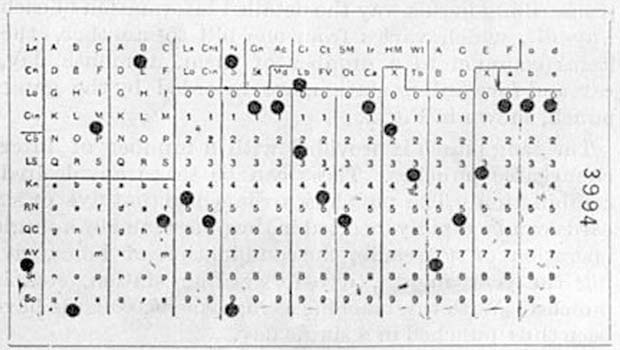

# 异步编程的历史

在开始阶段，计算机只有一个CPU，按照程序员编写的一系列指令逐个执行。没有调度，没有线程，没有多任务处理。这就是计算机工作的方式长时间以来一直是这样的。我们说的是那些程序看起来像这样的时代：

在计算机个人化逐渐兴起的80年代，像DOS这样的操作系统成为大多数消费者个人电脑的标准。

这些操作系统通常会将整个CPU的控制权交给当前正在执行的程序，程序员需要自行解决问题并为他们的程序实现任何类型的多任务处理。这种方式效果不错，但随着使用鼠标和窗口化操作系统的交互式用户界面成为常态，这种模式已经行不通了。

## 非抢占式多任务处理

为了保持UI交互性（并运行后台进程），首先使用的方法是所谓的**非抢占式多任务处理**。

这种多任务处理将让操作系统运行其他任务的责任，比如响应鼠标输入或运行后台任务，放在了程序员手中。

通常，程序员会将控制权**让渡**给操作系统。

除了将巨大的责任转嫁给为您的平台编写程序的每个程序员之外，这也很容易出错。程序代码中的小错误可能会导致整个系统停止或崩溃。

> 如果您还记得Windows 95，您可能还记得窗口挂起时的情况，您几乎可以使用它来绘制整个屏幕（几乎与Windows附带的纸牌游戏Solitaire中的结束方式相同）。
>
> 据报道，这是代码中典型的错误，本来应该将控制权让渡给操作系统。

## 抢占式多任务处理

尽管非抢占式多任务处理听起来是一个好主意，但事实证明它也会带来严重问题。让每个程序和程序员都负责在操作系统中拥有一个响应迅速的用户界面，如果每个错误都可能使整个系统停止运行，最终可能会导致糟糕的用户体验。

解决方案是将调度CPU资源的责任（包括操作系统本身）放在操作系统手中。操作系统可以停止一个进程的执行，执行其他操作，然后再切换回来。

在单核机器上，您可以将此想象为运行您编写的程序，操作系统必须在切换回您的程序继续执行之前停止您的程序以更新鼠标位置。这种情况经常发生，以至于我们无法观察到CPU是否有大量工作或者是空闲的差异。

然后，操作系统负责调度任务，并通过在CPU上切换上下文来执行此操作。这个过程可以每秒发生多次，不仅可以保持UI的响应性，而且还可以给其他后台任务和I/O事件一些时间。

这现在是设计操作系统的主流方式。

> 如果您想了解更多关于这种线程化多任务处理的信息，我建议阅读我之前关于[绿色线程](https://cfsamson.gitbook.io/green-threads-explained-in-200-lines-of-rust/)的书籍. 这是一个很好的介绍，您将能够获得有关线程、上下文、堆栈和调度的基本知识。

## 超线程

随着CPU的演变和增加了更多功能，比如多个ALU（算法逻辑单元）和更多的逻辑单元，CPU制造商意识到整个CPU从未被充分利用。例如，当一个操作只需要CPU的部分部分时，可以同时在ALU上运行指令。这就是超线程的开始。

现在，您的计算机上可能有6个内核和12个逻辑内核。这正是超线程发挥作用的地方。它通过使用CPU的未使用部分来同时驱动线程“2”上的代码运行，以模拟在同一个核心上的两个核心。它通过使用一些巧妙的技巧（比如ALU的技巧）来实现这一点。

现在，有了超线程，我们实际上可以将一些工作卸载到一个线程上，同时通过在第二个线程中响应事件来保持UI的交互性，即使我们只有一个CPU核心，也能更好地利用我们的硬件。

> 您可能会对超线程的性能感到好奇? 
> 
> 事实证明，自上世纪90年代以来，超线程一直在不断改进。由于您实际上并未运行两个CPU，因此有些操作需要等待彼此完成。与单核心中的多线程相比，超线程的性能增益似乎[接近30%](https://en.wikipedia.org/wiki/Hyper-threading#Performance_claims)，但这在很大程度上取决于工作负载。

## 多核处理器

大多数人都知道，处理器的时钟频率已经很长一段时间保持不变。处理器通过改进缓存、分支预测、推测执行以及处理器的处理流水线来提高速度，但是收益似乎在逐渐减少。

另一方面，新的处理器非常小，它们使我们能够在同一芯片上拥有许多处理器。现在，大多数CPU都有许多核心，而且大多数情况下，每个核心还具有执行超线程的能力。

## So how synchronous is the code you write, really?

就像许多事情一样，这取决于您的视角。从您的进程和您编写的代码的角度来看，一切通常会按照您编写的顺序发生。

从操作系统的角度来看，它可能会中断您的代码，暂停它，并在此期间运行其他代码，然后恢复您的进程。

从CPU的角度来看，它大多会逐条执行指令。不过，他们并不在乎是谁编写了代码，所以当硬件中断发生时，他们会立即停止并将控制权交给中断处理程序。这就是CPU处理并发的方式。

> 然而，现代CPU也可以并行执行许多任务。大多数CPU都是流水线化的，意味着下一条指令在当前指令执行时被加载。它可能具有分支预测器，试图弄清楚接下来加载哪些指令。
> 
> 如果处理器认为这样做可以加快速度而不需要“询问”或“告诉”程序员或操作系统，它还可以通过使用“乱序执行”重新排序指令，因此您可能无法保证 A 在 B 之前发生。
> 
> 处理器将一些工作分派给独立的“协处理器”，例如FPU用于浮点运算，使主CPU可以准备好执行其他任务等。
>
> 作为一个高层概述，将CPU建模为以同步方式运行是可以的，但暂时让我们记住，这是一个带有一些注意事项的模型，尤其在谈论并行性、同步原语（如互斥锁和原子操作）以及计算机和操作系统的安全性时，这变得尤为重要。

